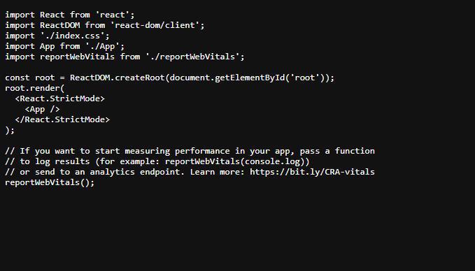

# Frontend do Projeto "backend-college-project"

Este repositório contém o **frontend do projeto fullstack "backend-college-project"**, que foi o meu **primeiro projeto fullstack**. Assim como mencionei no backend, este frontend também está bem desordenado, refletindo o meu conhecimento raso na época.

Apesar disso, foi uma experiência extremamente **enriquecedora**, com muito aprendizado. Fiz tudo **sozinho**, contando apenas com a ajuda do **ChatGPT** e tentando entender projetos de outras pessoas como referência.

---

## Tecnologias Utilizadas

- **HTML5**
- **CSS3**
- **JavaScript**

---

## Reflexão Pessoal

Olhem, está tão mal feito que nem a **Vercel** consegue renderizar direito. 😂 Mas, na época, **funcionava no meu PC** e era um website até grande, com vários filtros de busca. É aquilo: **arquitetura e design patterns passaram longe daqui!** 😅

Apesar disso, foi um passo importante na minha jornada como desenvolvedor, marcando o início de muitos aprendizados.

---

## Pré-visualização

  

---

📚 *Projeto desenvolvido durante a faculdade, cheio de aprendizados e superação!*
